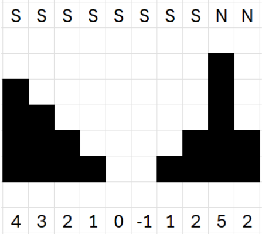

# Problema C - Oniso, ¡no te mojes!

Oniso es una oniscidea (bicho bola), que tiene una forma muy curiosa
de jugar. Se hace una bolita y se deja caer por las pendientes de su
jardín. Pero no le gusta rodar hasta que el agua le castigará sin
respirar durante cinco minutos. Su jardín es un tanto especial, ya que
a diferencia de nuestro mundo, el suyo es bidimensional, solo tiene
anchura (eje $x$) y altura (eje $y$), y no tiene profundidad.

Como hemos dicho, Oniso vive en un mundo bidimensional. Si se hace
bola en una posición $x$ rueda hacia $x + 1$ si la altura en $x + 1$
es menor que en $x$ y la altura en $x - 1$ es mayor que en $x$. De
forma simétrica, rodará desde la posición $x$ hacia la posición $x -
1$ si la altura en ese punto es menor y en $x + 1$ es mayor. En el
resto de casos no rueda. Oniso rueda hasta que llega a un punto que no
puede rodar.

El agua está en todas las posiciones que su altura es igual a cero o
menor.

Tenemos que ayudarle indicando desde cuántos puntos va a acabar
mojándose (pasará por agua). Hay que tener en cuenta que fuera del
jardín la altura es siempre una unidad mayor que cualquier altura del
jardín.

En la siguiente figura se muestra el jardín de Oniso. Abajo aparecen
las alturas, y arriba (S) si acaba mojándose si se hace bola en ese
punto y (N) si no acaba mojándose.



Tenemos que decirle desde cuántas coordenadas terminará en el agua.
En este caso desde las $8$ posiciones que tiene encima la letra S.

## Entrada

La entrada comienza con un número $t$ que indica el número de jardines
que hay que calcular ($t \le 2 \cdot 10^4$). A continuación, para cada
jardín aparece un número $w$ que es la anchura del jardín ($1 \le w
\le 10^5$), y en la siguiente línea las alturas de las $w$ posiciones:
$a_1, a_2, ..., a_w$. Se cumple que $-10^9 \le a_i \le 10^9$. En cada
caso de prueba, el total de número de alturas no superará $10^6$.

## Salida

Para cada caso de prueba tiene que indicar el número de posiciones en
las que acabará mojándose.

## Entrada de ejemplo

```
2
10
4 3 2 1 0 -1 1 2 5 2
6
0 1 1 1 0 1
```

## Salida de ejemplo

```
8
3
```
