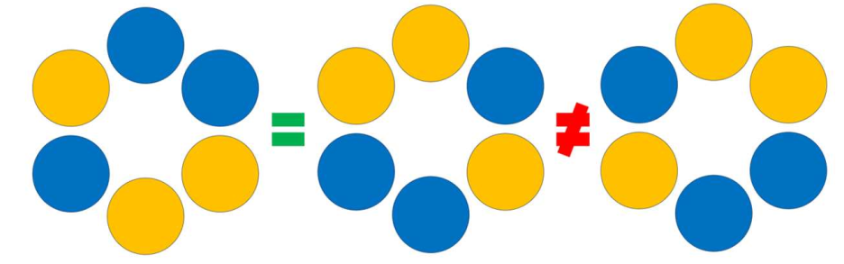

# Problema D - Collarín colorado

Érase una vez un joven bisutero llamado Matías que soñaba con alcanzar
la estabilidad económica vendiendo collares. Sus habilidades eran
insuperables en todo el reino; sin embargo, necesitaba ayuda para
determinar si su negocio podría llegar a ser rentable.

Matías fabrica collares utilizando cuentas de dos colores distintos.
Para cada collar utiliza exactamente una cantidad fija de cuentas de
cada color. Como auténtico maestro de su oficio, se niega a vender dos
collares idénticos, por lo que quiere saber cuántos collares
diferentes puede crear con las cuentas disponibles.

Dos collares se consideran iguales si, al rotarlos, se obtiene la
misma secuencia de colores en el mismo orden. Es decir, las rotaciones
de un collar no generan un diseño diferente. Sin embargo, los collares
de Matías son verdaderas obras de arte y está mal visto llevarlos del
revés: las reflexiones (efecto espejo) no se consideran equivalentes.

En la siguiente imagen se muestra un mismo collar representado
mediante dos rotaciones distintas, así como otro collar diferente
que, aunque similar, no es igual.



## Entrada

La primera línea contiene un número entero $t$, que indica el número
de casos de prueba.

Cada uno de los siguientes $t$ casos de prueba consiste en dos números
enteros no negativos que representan la cantidad de cuentas
disponibles de cada uno de los dos colores. La suma de ambos números
es al menos $1$ y no supera $20$.

## Salida

Para cada caso de prueba se debe imprimir en una línea el número total
de collares diferentes que se pueden construir utilizando exactamente
todas las cuentas disponibles.

## Entrada de ejemplo

```
2
3 3
1 1
```

## Salida de ejemplo

```
4
1
```
